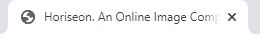
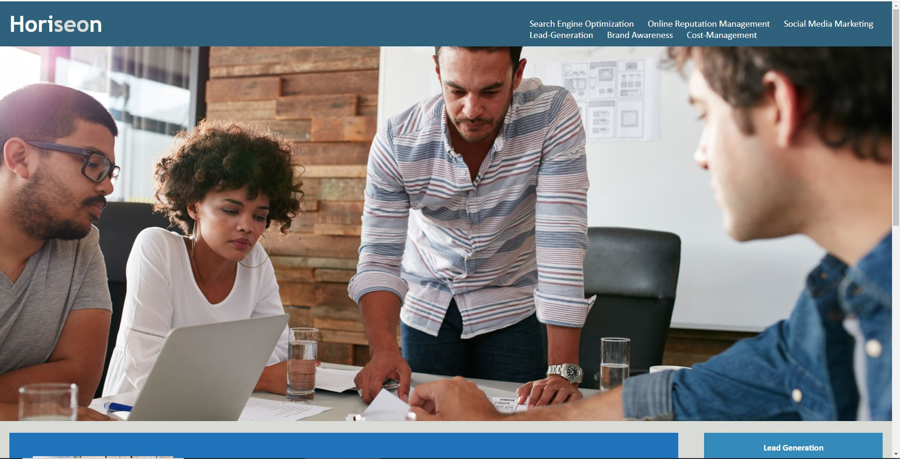
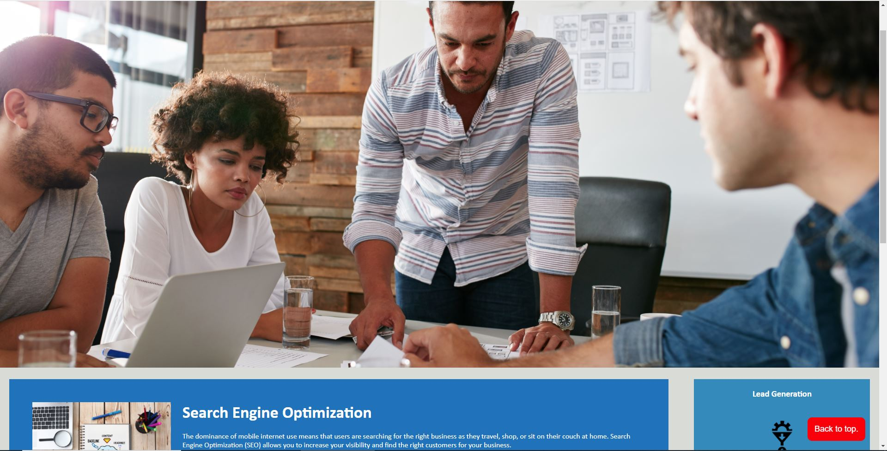

# Horiseon web page

## *Objective* 

    This Project is a Website Designed for a company that specilizes in image/and brand awarness.
    The task of this project was to take a mock up and make it a full featured demo page.
    There was an added task of making it more accessible without losing the original feel or content.

### Method

    I started by using some assets provied to me to meet the mockup. I then did some reaserch on accessability. 
    I found webaim.org (a group who focuses on web accesability) and through them the nfb(national federation for the blind). 
    The nfb put out a survey in 2016 on many topics but my key take-away was that there are many screen readers out there 
    with two leading in ussage(both in the 40%'s).One of them was on the fall and the other `NVDA` was on the rise. 
    i downloaded that software to try to familiarize myself with it whilst also doing some reading to try to find 
    wants and needs in the community.

    
   

### usage 
This page could be used as a starting place for making a web page accecible.

### Deployed website and screenshots

[Link](https://rickycohen88.github.io/CodeRefractor/)

### Contributing
Pull requests are welcome. For major changes, please open an issue first to discuss what you would like to change.

Please make sure to update tests as appropriate.

### License

    Made with ❤️️ by Horiseon
    2019 Horiseon Social Solution Services, Inc.
    
    © 2020 Trilogy Education Services, a 2U, Inc. brand. All Rights Reserved.

   